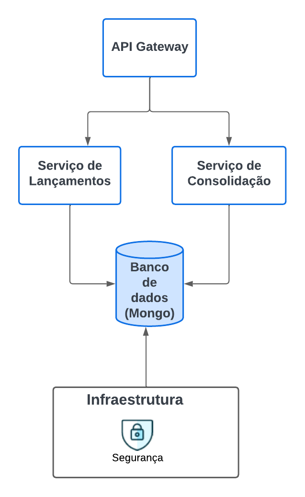

# CashFlow Project

## Descrição
O **CashFlow Project** é uma aplicação desenvolvida em .NET 9 que gerencia transações financeiras, permitindo a criação de entradas de débito e crédito. A aplicação utiliza autenticação JWT para proteger suas rotas, seguindo boas práticas de desenvolvimento com injeção de dependência e separação de responsabilidades.

## Funcionalidades
- **Entradas de Débito**: Permite criar registros de débito.
- **Entradas de Crédito**: Permite criar registros de crédito.
- **Autenticação JWT**: Garante que apenas usuários autenticados possam acessar as rotas protegidas.

## Tecnologias Utilizadas
- **.NET 9**
- **ASP.NET Core**
- **JWT Authentication**
- **OpenAPI** para documentação de APIs
- **xUnit** para testes unitários
- **Moq** para mocks em testes

## Pré-requisitos
Antes de rodar a aplicação, certifique-se de ter instalado:
- [.NET SDK 9.0](https://dotnet.microsoft.com/download/dotnet/9.0)
- Um editor de código, como o [Visual Studio 2022](https://visualstudio.microsoft.com/)

# Aplicação Transaction
### Configuração do Ambiente
1. Clone o repositório:
   ```git clone https://github.com/SuellenStefany/CashFlow.git``` 

   ```cd CashFlow/CashFlow.Transaction```
2. Restaure as dependências:
  ``` dotnet restore CashFlow.Transaction.sln```

3. Configure as variáveis de ambiente no arquivo `appsettings.json`:
   - Adicione as configurações de conexão com o banco de dados.
   - Configure as chaves de autenticação JWT.

## Executando a Aplicação Localmente
1. Compile o projeto:
  ``` dotnet build CashFlow.Transaction.sln```
2. Execute a aplicação:
  ``` dotnet run CashFlow.Transaction.sln```
3. Acesse a aplicação através da URL:
   - URL padrão: [http://localhost:5233](http://localhost:5233)
4. Acesse a documentação da API (OpenAPI/Scalar/v1):
   - [http://localhost:5233/scalar/v1](http://localhost:5233/scalar/v1)

## Testes
Para rodar os testes unitários:

```cd CashFlow.Transaction.Test```

```dotnet test CashFlow.Transaction.Test.csproj```

# Aplicação Consolidation
### Configuração do Ambiente
1. Clone o repositório:
   ```git clone https://github.com/SuellenStefany/CashFlow.git``` 

   ```cd CashFlow/CashFlow.Consolidation```
2. Restaure as dependências:
  ``` dotnet restore CashFlow.Consolidation.sln```

3. Configure as variáveis de ambiente no arquivo `appsettings.json`:
   - Adicione as configurações de conexão com o banco de dados.
   - Configure as chaves de autenticação JWT.

## Executando a Aplicação Localmente
1. Compile o projeto:
  ``` dotnet build CashFlow.Consolidation.sln```
2. Execute a aplicação:
  ``` dotnet run CashFlow.Consolidation.sln```
3. Acesse a aplicação através da URL:
   - URL padrão: [http://localhost:5233](http://localhost:5233)
4. Acesse a documentação da API (OpenAPI/Scalar/v1):
   - [http://localhost:5233/scalar/v1](http://localhost:5233/scalar/v1)

## Testes
Para rodar os testes unitários:

```cd CashFlow.Consolidation.Test```

```dotnet test CashFlow.Consolidation.Test.csproj```

# Estrutura do Projeto
- **API**: Contém os controladores para gerenciar as rotas de débito, crédito e consolidação.
- **Application**: Contém os serviços, DTOs e Interfaces utilizadas pela aplicação.
- **Domain**: Contém as entidades e enums.
- **Infrastructure**: Contém a lógica de autenticação, configurações de dependências, conexão com o banco e os repositorios.
- **Tests**: Contém os testes unitários para os controladores.

## Arquitetura do Projeto
- **DDD**: O projeto foi estruturado seguindo os princípios de Domain-Driven Design (DDD), separando as responsabilidades em diferentes camadas.
- **SOLID**: O projeto segue os princípios SOLID para garantir um código limpo e de fácil manutenção.
- **Melhores Práticas**: O projeto utiliza boas práticas de desenvolvimento, como injeção de dependência, separação de responsabilidades e testes automatizados.

## Arquitetura da Solução
<p align="center">
  
</p>